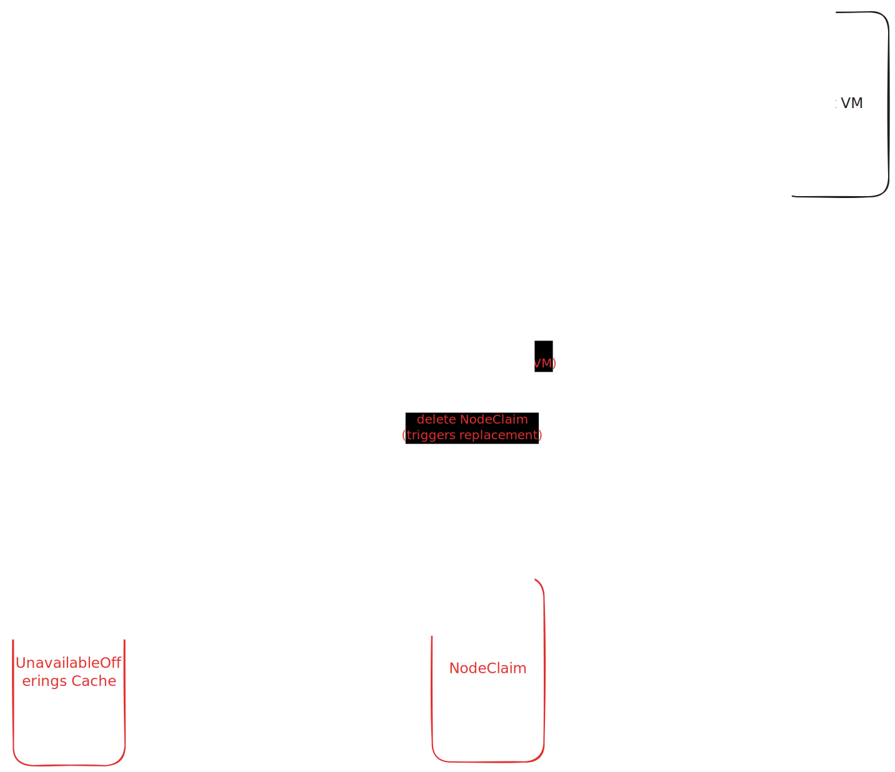

# Spot Instances Support Document

## Background

This design document is regarding the Github issue: https://github.com/kubernetes-sigs/karpenter-provider-ibm-cloud/issues/501. Briefly, we want to support Spot Instances in IBM Karpenter.

---

## Goals

This document discusses:

- IBM Cloud API capabilities and limitations
- High-level design for spot instance lifecycle
- Detailed implementation plan

---

## IBM API Reality Check

Going through the [IBM documentation](https://cloud.ibm.com/docs/vpc?topic=vpc-spot-instances-virtual-servers#spot-instances-preemption) this was found:

### Spot Support

Spot instances are supported via:

- `InstanceAvailabilityPrototype.Class = "spot"`.
- `InstanceAvailabilityPolicyPrototype.Preemption = "delete"` or `"stop"` (default is `"stop"`).
- `InstanceProfile.AvailabilityClass` indicates which profiles support spot.

### Pricing

- No public API for spot pricing.
- No equivalent to AWS [DescribeSpotPriceHistory](https://github.com/aws/karpenter-provider-aws/blob/7caf2f28fce1b29d61157c7a1f877d31201e11cb/pkg/aws/sdk.go#L37)
- Opened an issue regarding that: [IBM/vpc-go-sdk#152](https://github.com/IBM/vpc-go-sdk/issues/152)

### Interruption Handling

- AWS uses an [event driven](https://karpenter.sh/v1.0/reference/cloudformation/#interruption-handling:~:text=Copy-,Interruption%20Handling,-Settings%20in%20this) approach where EC2 emits spot interruption events to EventBridge, which routes them to an SQS queue. Karpenter consumes messages from this queue. Example message:

```
{
  "source": "aws.ec2",
  "detail-type": "EC2 Spot Instance Interruption Warning",
  "detail": {
    "instance-id": "i-0abc123...",
    "instance-action": "terminate"
  }
}
```

The handler that processes these can be found [here](https://github.com/aws/karpenter-provider-aws/blob/7caf2f28fce1b29d61157c7a1f877d31201e11cb/pkg/controllers/interruption/controller.go#L219).

- For our implementation we have three ways:
  1. OS-level graceful shutdown command sent to guest.
  2. User-facing log emitted at preemption start via IBM Cloud Logging.
  3. Use ListInstances which supports filtering by availability.class = "spot" for efficient bulk detection in a single API call. There is even `InstanceStatusReason.Code = "stopped_by_preemption"`.
- **30-second best-effort grace period** before forced shutdown.

### Spot Constraints

Spot instances require:

- `reservation_affinity.policy = disabled`
- No dedicated host or host group placement

```go
type InstanceAvailabilityPrototype struct {
	// The availability class for the virtual server instance:
	// - `spot`: The virtual server instance may be preempted.
	// - `standard`: The virtual server instance will not be preempted.
	//
	// If `spot` is specified, the virtual server instance:
	// - `reservation_affinity.policy` must be `disabled`
	// - `placement_target` must not specify a dedicated host or dedicated host group.
	//
	// If unspecified, the default for `availability_class` from the profile will be used.
	Class *string `json:"class,omitempty"`
}
```

- [**Only GPU and Flex profiles**](https://cloud.ibm.com/docs/vpc?topic=vpc-spot-instances-virtual-servers#spot-instances-details) support spot

---

## High Level Design


1. The Scheduler filters available spot offerings and creates a NodeClaim with the most suitable option.
2. The VPC Instance Provider fulfills it by calling CreateInstance with spot-specific parameters.
3. When IBM preempts the instance, the Interruption Controller detects it, marks that offering as unavailable in the cache, and deletes the NodeClaim.
4. The Scheduler then provisions a replacement, but with the preempted offering filtered out, picking a different available offering.

---

## Design Decisions

### 1. Preemption policy: `"delete"` or `"stop"`

- We are choosing here between reliability of signal or simplicity of cleanup and extra cost.
- With preemption = `"stop"`:
  1. IBM stops the instance.
  2. We poll, find it stopped with explicit status reason of stopped_by_preemption.
  3. We call DeleteInstance to clean it up.
  4. We mark cache + delete NodeClaim.
- With preemption = `"delete"`:
  1. IBM deletes the instance.
  2. We poll, notice a known spot instance is missing.
  3. We mark cache + delete NodeClaim.
- The issue with the `"delete"` is the false positives. The deletion could be for any other reasons like manual deletion for example. and in this case we will mark the offering as unavailable.
- We will go with `"stop"` because it gives an unambiguous detection signal.

### 2. Discount factor for spot pricing

- There is no public API for spot pricing in IBM.
- We can initially go with `spotPrice = onDemandPrice × discountFactor`

### 3. Per zone offerings

- The current IBM code creates one offering with all zones.

[instancetype.go#L726](https://github.com/kubernetes-sigs/karpenter-provider-ibm-cloud/blob/0ecb082e09c5a3276395ea555b44370fdceef15d/pkg/providers/common/instancetype/instancetype.go#L726)

- We will change it to per-zone offerings. If spot capacity is preempted in us-south-1, we need to mark only (us-south-1, spot) as unavailable, not the same instance type in us-south-2 or us-south-3.

### 4. Cache key includes capacity type

- The UnavailableOfferings cache key will be capacityType:instanceType:zone

[controller.go#L460](https://github.com/kubernetes-sigs/karpenter-provider-ibm-cloud/blob/0ecb082e09c5a3276395ea555b44370fdceef15d/pkg/controllers/interruption/controller.go#L460)

- Additionally, the current cache is not read anywhere. This implementation will wire it for the first time.

### 5. Interruption detection

We have three options here:

1. OS-level graceful shutdown signal

- IBM sends a graceful shutdown command to the guest OS at the start of preemption. However, this would require introducing a mechanism to propagate the OS-level signal to Karpenter.

2. IBM Cloud Logs

- IBM Cloud Logging emits a structured platform log at the moment a spot instance is selected for preemption ([messageId: instance.00002](https://cloud.ibm.com/docs/vpc?topic=vpc-logging#:~:text=instance.00002,selected%20for%20preemption.)). This signal is available before the 30-second grace period.
- We can (A) poll the Logs API or (B) configure IBM Cloud Event Notifications to push preemption events to Karpenter.
- However, according to the [documentation](https://cloud.ibm.com/docs/logs-router?topic=logs-router-getting-started&utm_source=chatgpt.com#:~:text=To%20configure%20platform%20logs%2C%20you%20must%20configure%20tenants%20and%20targets%20(destinations)%20in%20your%20IBM%20Cloud%20account.) platform logs require explicit configurations in IBM Cloud Logs Routing, making it unsuitable as the default detection mechanism.

3. Poll VPC API (ListInstances)

- This is the most reasonable option as a start. will keep polling the VPC API and checking instance status reasons. Note: the 60s for polling is what we [currently use in reconcile](https://github.com/kubernetes-sigs/karpenter-provider-ibm-cloud/blob/0ecb082e09c5a3276395ea555b44370fdceef15d/pkg/controllers/interruption/controller.go#L148) and there is no strong reason to change it.



- To summarize our options:

|  | Option 1: OS-level Shutdown | Option 2A: Logs API Polling | Option 2B: Cloud Logs + Event Notifications | Option 3: VPC API Polling |
| --- | --- | --- | --- | --- |
| Signal | Guest OS shutdown command | Platform log `instance.00002` | Platform log `instance.00002` (delivered as event) | `stopped_by_preemption` |
| Delivery | Push (inside VM) | Pull | Push | Pull |
| Detection timing | At preemption start | At preemption start | At preemption start (near real-time) | After preemption completes |
| Extra setup required | Agent on every spot node (to relay signal to control plane) | Cloud Logs Routing | Cloud Logs + Event Notifications + alert rule + webhook/queue | None |
| Works for all users | Only if agent deployed | Only if Cloud Logs configured | Only if full pipeline configured | Yes |
| Complexity | High | Medium | High | Low |

---

## Implementation Plan

### Task 1: Shared helpers

New file: pkg/providers/common/capacitytype/capacitytype.go

```go
// ResolveCapacityType picks the capacity type for a NodeClaim.
// Mirrors AWS's getCapacityType() logic.
func ResolveCapacityType(nodeClaim, instanceTypes) string {
    allowed := nodeClaim.Requirements["karpenter.sh/capacity-type"]

    if allowed.Has("spot") {
        for each instanceType in instanceTypes {
            if instanceType has available spot offering matching requirements {
                return "spot"
            }
        }
    }
    return "on-demand"
}

// CapacityTypeFromAvailabilityClass maps VPC availability class -> Karpenter label.
//   "spot"     -> "spot"
//   anything else -> "on-demand"
func CapacityTypeFromAvailabilityClass(class string) string { ... }
```

### Task 2: Update cache callers

Modify file: pkg/controllers/interruption/controller.go

- [controller.go#L460](https://github.com/kubernetes-sigs/karpenter-provider-ibm-cloud/blob/0ecb082e09c5a3276395ea555b44370fdceef15d/pkg/controllers/interruption/controller.go#L460)
- [controller.go#L499](https://github.com/kubernetes-sigs/karpenter-provider-ibm-cloud/blob/0ecb082e09c5a3276395ea555b44370fdceef15d/pkg/controllers/interruption/controller.go#L499)

Update the two write sites to use `capacityType:instanceType:zone`

### Task 3: Add getSpotPrice

Modify file: pkg/providers/common/pricing/ibm_provider.go

- A) Add new function:

```go
func (p *IBMPricingProvider) GetSpotPrice(ctx context.Context, instanceType string, zone string) (float64, error) {
	onDemandPrice, err := p.GetPrice(ctx, instanceType, zone)
	if err != nil {
		return 0, err
	}
	return onDemandPrice * SpotDiscountFactor, nil
}
```

- B) Add it to provider interface

```go
// In pkg/providers/common/pricing/provider.go
type Provider interface {
    GetPrice(ctx context.Context, instanceType string, zone string) (float64, error)
    GetSpotPrice(ctx context.Context, instanceType string, zone string) (float64, error)  // new
    GetPrices(ctx context.Context, zone string) (map[string]float64, error)
    Refresh(ctx context.Context) error
}
```

### Task 4: Per-zone, per-capacity-type offerings + wire cache read

Modify file: pkg/providers/common/instancetype/instancetype.go

- A) Struct Change: Add unavailableOfferings to IBMInstanceTypeProvider:

```go
type IBMInstanceTypeProvider struct {
	client           *ibm.Client
	pricingProvider  pricing.Provider
	zonesCacheTime   time.Time
	...

	unavailableOfferings *cache.UnavailableOfferings
}
```

- B) Update convertVPCProfileToInstanceType to have multiple zones and read from cache.

Existing code:

```go
	// Create offerings with on-demand capacity in all supported zones
	offerings := cloudprovider.Offerings{
		{
			Requirements: scheduling.NewRequirements(
				scheduling.NewRequirement(corev1.LabelTopologyZone, corev1.NodeSelectorOpIn, zones...),
				scheduling.NewRequirement("karpenter.sh/capacity-type", corev1.NodeSelectorOpIn, "on-demand"),
			),
			Price:     0.1, // Default price when pricing provider unavailable
			Available: true,
		},
	}
```

What we want:

```go
// Step 1: Read what capacity types this profile supports
supportedCapacityTypes := ["on-demand"]

// profile.AvailabilityClass is an interface; type-assert to get values
switch ac := profile.AvailabilityClass.(type) {
case *vpcv1.InstanceProfileAvailabilityClassEnum:
    if ac.Values contains "spot" {
        supportedCapacityTypes = append(supportedCapacityTypes, "spot")
    }
case *vpcv1.InstanceProfileAvailabilityClassFixed:
    if ac.Value == "spot" {
        supportedCapacityTypes = ["spot"]  // fixed = only this class
    }
}

// Step 2: Build one offering per (zone x capacityType)
offerings := []
for each zone in zones {
    for each ct in supportedCapacityTypes {
        if ct == "spot" {
            price = pricingProvider.GetSpotPrice(ctx, profileName, zone)
        } else {
            price = pricingProvider.GetPrice(ctx, profileName, zone)
        }

        key := cache.OfferingKey(ct, profileName, zone)
        offerings = append(offerings, Offering{
            Requirements: zone + ct,
            Price:        price,
            Available:    !p.unavailableOfferings.IsUnavailable(key),
        })
    }
}
```

### Task 5: Handle spot in instance creation

Modify file: pkg/providers/vpc/instance/provider.go

- A) Resolve capacity type in Create() by calling [ResolveCapacityType(nodeClaim, instanceTypes)](#task-1-shared-helpers)
- B) Set VPC API fields for spot

What we currently have:

```go
	instancePrototype.AvailabilityPolicy = &vpcv1.InstanceAvailabilityPolicyPrototype{
		HostFailure: &[]string{"restart"}[0],
	}
```

What we want to add:

```go
if capacityType == karpv1.CapacityTypeSpot {
		instancePrototype.Availability = &vpcv1.InstanceAvailabilityPrototype{
			Class: core.StringPtr("spot"),
		}
		instancePrototype.AvailabilityPolicy = &vpcv1.InstanceAvailabilityPolicyPrototype{
			Preemption:  core.StringPtr("stop"),
		}
		instancePrototype.ReservationAffinity = &vpcv1.InstanceReservationAffinityPrototype{
			Policy: core.StringPtr("disabled"),
		}
	}
```

`Preemption: core.StringPtr("stop")` was discussed in [Decision 1](#1-preemption-policy-delete-or-stop).
`Policy: core.StringPtr("disabled")` discussed in [Spot Constraints](#spot-constraints).

- C) Set label dynamically

In create we set `"karpenter.sh/capacity-type": "on-demand"`
Change it to `"karpenter.sh/capacity-type": capacityType`

### Task 6: Add Spot label in CloudProvider.Get()

Currently Get() doesn't know if the instance is spot or on-demand

- A) Modify VPC instance provider Get() in file: pkg/providers/vpc/instance/provider.go

What we have:

```go
	node := &corev1.Node{
		ObjectMeta: metav1.ObjectMeta{
			Name: *instance.Name,
		},
		Spec: corev1.NodeSpec{
			ProviderID: providerID,
		},
	}
```

What we want:

```go
capacityType := karpv1.CapacityTypeOnDemand
if instance.Availability != nil && instance.Availability.Class != nil {
		capacityType = CapacityTypeFromAvailabilityClass(*instance.Availability.Class)
}

node := &corev1.Node{
	ObjectMeta: metav1.ObjectMeta{
		Name: *instance.Name,
		Labels: map[string]string{
			"karpenter.sh/capacity-type": capacityType,
		},
	},
	Spec: corev1.NodeSpec{
		ProviderID: providerID,
	},
}
```

Note: [CapacityTypeFromAvailabilityClass is from Task 1](#task-1-shared-helpers).

- B) Modify CloudProvider Get() in file: pkg/cloudprovider/cloudprovider.go

What we have:

```go
	nc := &karpv1.NodeClaim{
		Status: karpv1.NodeClaimStatus{
			ProviderID: providerID,
		},
	}
```

What we want:

```go
nc := &karpv1.NodeClaim{
		ObjectMeta: metav1.ObjectMeta{
			Labels: map[string]string{
				karpv1.CapacityTypeLabelKey: node.Labels["karpenter.sh/capacity-type"],
			},
		},
		Status: karpv1.NodeClaimStatus{
			ProviderID: providerID,
		},
	}
```

### Task 7: Interruption controller, spot preemption detection

Modify file: pkg/controllers/interruption/controller.go

- We already have this reconcile function:

```go
// Reconcile executes a control loop for the resource
func (c *Controller) Reconcile(ctx context.Context) (reconciler.Result, error) {
	nodeList := &v1.NodeList{}
	if err := c.kubeClient.List(ctx, nodeList); err != nil {
		return reconciler.Result{}, err
	}

	for _, node := range nodeList.Items {
		// Check if node is being interrupted
		interrupted, reason := c.isNodeInterrupted(ctx, &node)
		if !interrupted {
			continue
		}
		// mark, event, handle ...

	}

	return reconciler.Result{RequeueAfter: time.Minute}, nil
}
```

- We want to call check for preempted instances after the existing node loop in Reconcile

```go
func (c *Controller) checkSpotPreemptions(ctx context.Context) {
    vpcClient := ...  // get VPC client from providerFactory

    // List only spot instances in one API call
    instances := vpcClient.ListInstances(&ListInstancesOptions{
        AvailabilityClass: "spot",
    })

    for each instance in instances {
        // Only care about Karpenter-managed instances
        nodeClaim := matchToNodeClaim(instance.ID)
        if nodeClaim == nil {
            continue
        }

        // Check status reasons for preemption
        for each reason in instance.StatusReasons {
            if reason.Code == "stopped_by_preemption" {
                instanceType := instance.Profile.Name
                zone := instance.Zone.Name

                // 1. Mark offering unavailable
                key := cache.OfferingKey("spot", instanceType, zone)
                c.unavailableOfferings.Add(key, time.Now().Add(time.Hour))

                // 2. Delete the stopped VM (it's just sitting there costing boot volume $)
                vpcClient.DeleteInstance(instance.ID)

                // 3. Delete the NodeClaim so Karpenter schedules a replacement
                c.kubeClient.Delete(nodeClaim)

                // 4. Record event
                c.recorder.Event(node, "Warning", "SpotPreemption",
                    "Spot instance preempted by IBM Cloud")
            }
        }
    }
}
```

### Task 8: Example NodePool configurations

New file: examples/spot.yaml

- We want something like this:

```yaml
apiVersion: karpenter.sh/v1
kind: NodePool
metadata:
  name: spot
spec:
  template:
    spec:
      requirements:
        - key: karpenter.sh/capacity-type
          operator: In
          values: ["spot"]
      nodeClassRef:
        group: karpenter-ibm.sh
        kind: IBMNodeClass
        name: default
  disruption:
    consolidationPolicy: WhenUnderutilized
    consolidateAfter: 10s
    expireAfter: 12h
```
